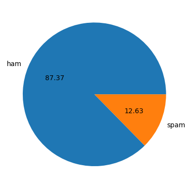
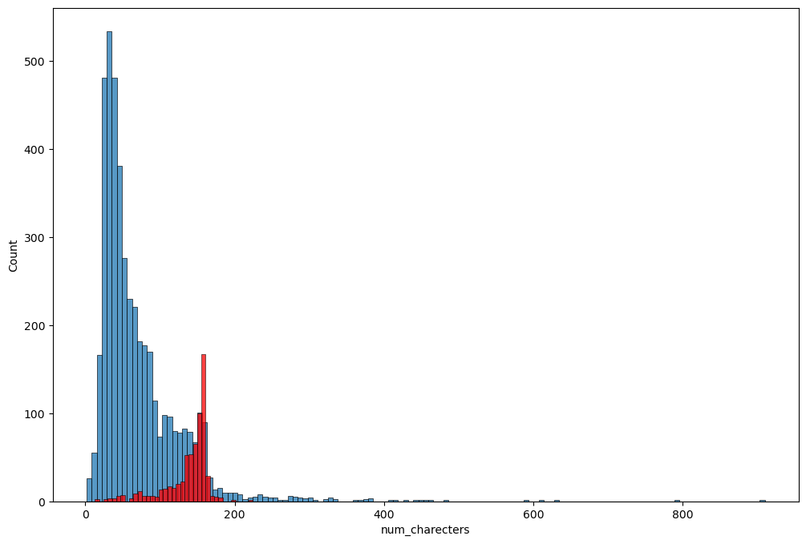
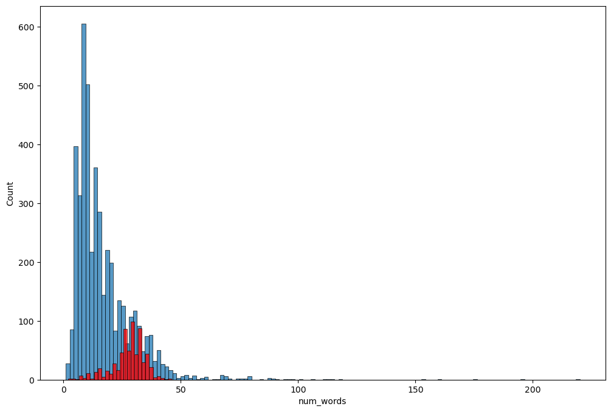
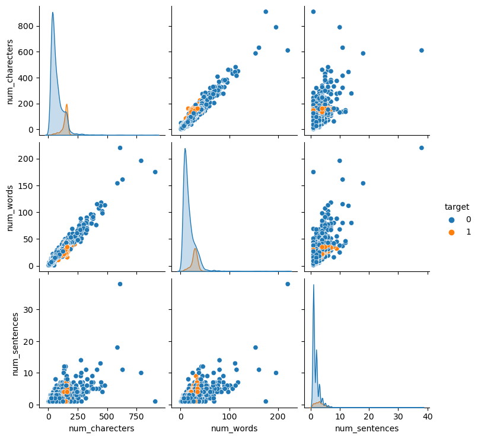
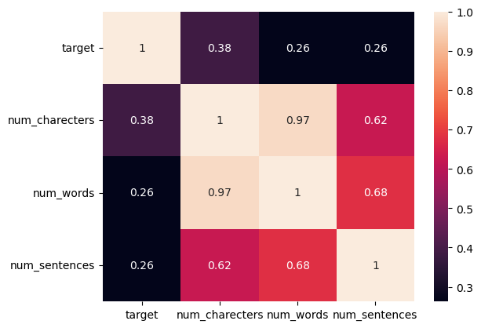
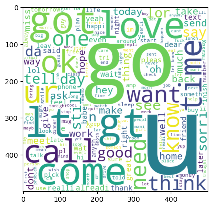
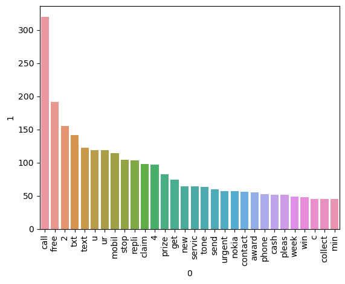
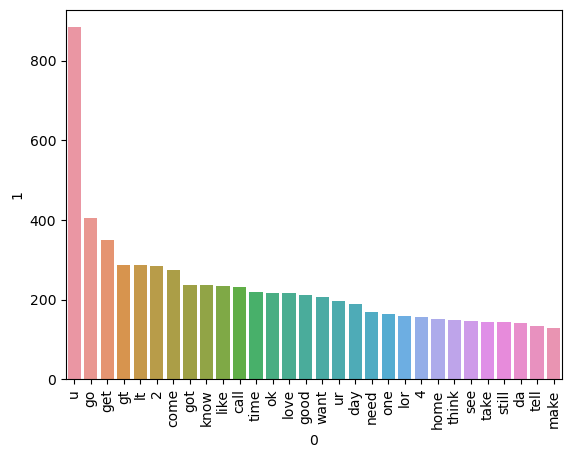

```python
import pandas as pd
import numpy as np
```


```python
df= pd.read_csv('spam.csv',encoding='latin1')
```


```python
df.head()
```


<div>
<style scoped>
    .dataframe tbody tr th:only-of-type {
        vertical-align: middle;
    }

    .dataframe tbody tr th {
        vertical-align: top;
    }

    .dataframe thead th {
        text-align: right;
    }
</style>
<table border="1" class="dataframe">
  <thead>
    <tr style="text-align: right;">
      <th></th>
      <th>v1</th>
      <th>v2</th>
      <th>Unnamed: 2</th>
      <th>Unnamed: 3</th>
      <th>Unnamed: 4</th>
    </tr>
  </thead>
  <tbody>
    <tr>
      <th>0</th>
      <td>ham</td>
      <td>Go until jurong point, crazy.. Available only ...</td>
      <td>NaN</td>
      <td>NaN</td>
      <td>NaN</td>
    </tr>
    <tr>
      <th>1</th>
      <td>ham</td>
      <td>Ok lar... Joking wif u oni...</td>
      <td>NaN</td>
      <td>NaN</td>
      <td>NaN</td>
    </tr>
    <tr>
      <th>2</th>
      <td>spam</td>
      <td>Free entry in 2 a wkly comp to win FA Cup fina...</td>
      <td>NaN</td>
      <td>NaN</td>
      <td>NaN</td>
    </tr>
    <tr>
      <th>3</th>
      <td>ham</td>
      <td>U dun say so early hor... U c already then say...</td>
      <td>NaN</td>
      <td>NaN</td>
      <td>NaN</td>
    </tr>
    <tr>
      <th>4</th>
      <td>ham</td>
      <td>Nah I don't think he goes to usf, he lives aro...</td>
      <td>NaN</td>
      <td>NaN</td>
      <td>NaN</td>
    </tr>
  </tbody>
</table>
</div>


```python
df.shape
```


    (5572, 5)


# 1.Data Cleaning


```python
df.info()
```

    <class 'pandas.core.frame.DataFrame'>
    RangeIndex: 5572 entries, 0 to 5571
    Data columns (total 5 columns):
     #   Column      Non-Null Count  Dtype 
    ---  ------      --------------  ----- 
     0   v1          5572 non-null   object
     1   v2          5572 non-null   object
     2   Unnamed: 2  50 non-null     object
     3   Unnamed: 3  12 non-null     object
     4   Unnamed: 4  6 non-null      object
    dtypes: object(5)
    memory usage: 217.8+ KB
    


```python
# drop last 3 cols
df.drop(columns=['Unnamed: 2','Unnamed: 3','Unnamed: 4'],inplace=True)

```


```python
df.head()
```


<div>
<style scoped>
    .dataframe tbody tr th:only-of-type {
        vertical-align: middle;
    }

    .dataframe tbody tr th {
        vertical-align: top;
    }

    .dataframe thead th {
        text-align: right;
    }
</style>
<table border="1" class="dataframe">
  <thead>
    <tr style="text-align: right;">
      <th></th>
      <th>v1</th>
      <th>v2</th>
    </tr>
  </thead>
  <tbody>
    <tr>
      <th>0</th>
      <td>ham</td>
      <td>Go until jurong point, crazy.. Available only ...</td>
    </tr>
    <tr>
      <th>1</th>
      <td>ham</td>
      <td>Ok lar... Joking wif u oni...</td>
    </tr>
    <tr>
      <th>2</th>
      <td>spam</td>
      <td>Free entry in 2 a wkly comp to win FA Cup fina...</td>
    </tr>
    <tr>
      <th>3</th>
      <td>ham</td>
      <td>U dun say so early hor... U c already then say...</td>
    </tr>
    <tr>
      <th>4</th>
      <td>ham</td>
      <td>Nah I don't think he goes to usf, he lives aro...</td>
    </tr>
  </tbody>
</table>
</div>


```python
#rename cols
df.rename(columns={'v1':'target','v2':'text'},inplace=True)
df.head()
```


<div>
<style scoped>
    .dataframe tbody tr th:only-of-type {
        vertical-align: middle;
    }

    .dataframe tbody tr th {
        vertical-align: top;
    }

    .dataframe thead th {
        text-align: right;
    }
</style>
<table border="1" class="dataframe">
  <thead>
    <tr style="text-align: right;">
      <th></th>
      <th>target</th>
      <th>text</th>
    </tr>
  </thead>
  <tbody>
    <tr>
      <th>0</th>
      <td>ham</td>
      <td>Go until jurong point, crazy.. Available only ...</td>
    </tr>
    <tr>
      <th>1</th>
      <td>ham</td>
      <td>Ok lar... Joking wif u oni...</td>
    </tr>
    <tr>
      <th>2</th>
      <td>spam</td>
      <td>Free entry in 2 a wkly comp to win FA Cup fina...</td>
    </tr>
    <tr>
      <th>3</th>
      <td>ham</td>
      <td>U dun say so early hor... U c already then say...</td>
    </tr>
    <tr>
      <th>4</th>
      <td>ham</td>
      <td>Nah I don't think he goes to usf, he lives aro...</td>
    </tr>
  </tbody>
</table>
</div>


```python
from sklearn.preprocessing import LabelEncoder
encoder=LabelEncoder()
```


```python
df['target'] = encoder.fit_transform(df['target'])
```


```python
df.head()
```


<div>
<style scoped>
    .dataframe tbody tr th:only-of-type {
        vertical-align: middle;
    }

    .dataframe tbody tr th {
        vertical-align: top;
    }

    .dataframe thead th {
        text-align: right;
    }
</style>
<table border="1" class="dataframe">
  <thead>
    <tr style="text-align: right;">
      <th></th>
      <th>target</th>
      <th>text</th>
    </tr>
  </thead>
  <tbody>
    <tr>
      <th>0</th>
      <td>0</td>
      <td>Go until jurong point, crazy.. Available only ...</td>
    </tr>
    <tr>
      <th>1</th>
      <td>0</td>
      <td>Ok lar... Joking wif u oni...</td>
    </tr>
    <tr>
      <th>2</th>
      <td>1</td>
      <td>Free entry in 2 a wkly comp to win FA Cup fina...</td>
    </tr>
    <tr>
      <th>3</th>
      <td>0</td>
      <td>U dun say so early hor... U c already then say...</td>
    </tr>
    <tr>
      <th>4</th>
      <td>0</td>
      <td>Nah I don't think he goes to usf, he lives aro...</td>
    </tr>
  </tbody>
</table>
</div>


```python
#missing values:
df.isnull().sum()
```


    target    0
    text      0
    dtype: int64


```python
# check for duplicate values
df.duplicated().sum()
```


    403


```python
df=df.drop_duplicates(keep='first')
```


```python
df.duplicated().sum()
```


    0


```python
df.shape
```


    (5169, 2)


# 2.EDA


```python
df['target'].value_counts()
```


    0    4516
    1     653
    Name: target, dtype: int64


```python
import matplotlib.pyplot as plt
plt.pie(df['target'].value_counts(),labels=['ham','spam'],autopct='%0.2f')
plt.show()
```


    

    


```python
import nltk
```


```python
nltk.download('punkt')
```

    [nltk_data] Downloading package punkt to
    [nltk_data]     C:\Users\rakes\AppData\Roaming\nltk_data...
    [nltk_data]   Package punkt is already up-to-date!
    


    True


```python
df['num_charecters'] = df['text'].apply(len) 

```


```python
df.head()
```


<div>
<style scoped>
    .dataframe tbody tr th:only-of-type {
        vertical-align: middle;
    }

    .dataframe tbody tr th {
        vertical-align: top;
    }

    .dataframe thead th {
        text-align: right;
    }
</style>
<table border="1" class="dataframe">
  <thead>
    <tr style="text-align: right;">
      <th></th>
      <th>target</th>
      <th>text</th>
      <th>num_charecters</th>
    </tr>
  </thead>
  <tbody>
    <tr>
      <th>0</th>
      <td>0</td>
      <td>Go until jurong point, crazy.. Available only ...</td>
      <td>111</td>
    </tr>
    <tr>
      <th>1</th>
      <td>0</td>
      <td>Ok lar... Joking wif u oni...</td>
      <td>29</td>
    </tr>
    <tr>
      <th>2</th>
      <td>1</td>
      <td>Free entry in 2 a wkly comp to win FA Cup fina...</td>
      <td>155</td>
    </tr>
    <tr>
      <th>3</th>
      <td>0</td>
      <td>U dun say so early hor... U c already then say...</td>
      <td>49</td>
    </tr>
    <tr>
      <th>4</th>
      <td>0</td>
      <td>Nah I don't think he goes to usf, he lives aro...</td>
      <td>61</td>
    </tr>
  </tbody>
</table>
</div>


```python
df['num_words']= df['text'].apply(lambda x:len(nltk.word_tokenize(x)))
```


```python
df.head()
```


<div>
<style scoped>
    .dataframe tbody tr th:only-of-type {
        vertical-align: middle;
    }

    .dataframe tbody tr th {
        vertical-align: top;
    }

    .dataframe thead th {
        text-align: right;
    }
</style>
<table border="1" class="dataframe">
  <thead>
    <tr style="text-align: right;">
      <th></th>
      <th>target</th>
      <th>text</th>
      <th>num_charecters</th>
      <th>num_words</th>
    </tr>
  </thead>
  <tbody>
    <tr>
      <th>0</th>
      <td>0</td>
      <td>Go until jurong point, crazy.. Available only ...</td>
      <td>111</td>
      <td>24</td>
    </tr>
    <tr>
      <th>1</th>
      <td>0</td>
      <td>Ok lar... Joking wif u oni...</td>
      <td>29</td>
      <td>8</td>
    </tr>
    <tr>
      <th>2</th>
      <td>1</td>
      <td>Free entry in 2 a wkly comp to win FA Cup fina...</td>
      <td>155</td>
      <td>37</td>
    </tr>
    <tr>
      <th>3</th>
      <td>0</td>
      <td>U dun say so early hor... U c already then say...</td>
      <td>49</td>
      <td>13</td>
    </tr>
    <tr>
      <th>4</th>
      <td>0</td>
      <td>Nah I don't think he goes to usf, he lives aro...</td>
      <td>61</td>
      <td>15</td>
    </tr>
  </tbody>
</table>
</div>


```python
df['num_sentences']= df['text'].apply(lambda x:len(nltk.sent_tokenize(x)))
```


```python
df.head()
```


<div>
<style scoped>
    .dataframe tbody tr th:only-of-type {
        vertical-align: middle;
    }

    .dataframe tbody tr th {
        vertical-align: top;
    }

    .dataframe thead th {
        text-align: right;
    }
</style>
<table border="1" class="dataframe">
  <thead>
    <tr style="text-align: right;">
      <th></th>
      <th>target</th>
      <th>text</th>
      <th>num_charecters</th>
      <th>num_words</th>
      <th>num_sentences</th>
    </tr>
  </thead>
  <tbody>
    <tr>
      <th>0</th>
      <td>0</td>
      <td>Go until jurong point, crazy.. Available only ...</td>
      <td>111</td>
      <td>24</td>
      <td>2</td>
    </tr>
    <tr>
      <th>1</th>
      <td>0</td>
      <td>Ok lar... Joking wif u oni...</td>
      <td>29</td>
      <td>8</td>
      <td>2</td>
    </tr>
    <tr>
      <th>2</th>
      <td>1</td>
      <td>Free entry in 2 a wkly comp to win FA Cup fina...</td>
      <td>155</td>
      <td>37</td>
      <td>2</td>
    </tr>
    <tr>
      <th>3</th>
      <td>0</td>
      <td>U dun say so early hor... U c already then say...</td>
      <td>49</td>
      <td>13</td>
      <td>1</td>
    </tr>
    <tr>
      <th>4</th>
      <td>0</td>
      <td>Nah I don't think he goes to usf, he lives aro...</td>
      <td>61</td>
      <td>15</td>
      <td>1</td>
    </tr>
  </tbody>
</table>
</div>


```python
df[['num_charecters','num_words','num_sentences']].describe()
```


<div>
<style scoped>
    .dataframe tbody tr th:only-of-type {
        vertical-align: middle;
    }

    .dataframe tbody tr th {
        vertical-align: top;
    }

    .dataframe thead th {
        text-align: right;
    }
</style>
<table border="1" class="dataframe">
  <thead>
    <tr style="text-align: right;">
      <th></th>
      <th>num_charecters</th>
      <th>num_words</th>
      <th>num_sentences</th>
    </tr>
  </thead>
  <tbody>
    <tr>
      <th>count</th>
      <td>5169.000000</td>
      <td>5169.000000</td>
      <td>5169.000000</td>
    </tr>
    <tr>
      <th>mean</th>
      <td>78.977945</td>
      <td>18.455794</td>
      <td>1.965564</td>
    </tr>
    <tr>
      <th>std</th>
      <td>58.236293</td>
      <td>13.324758</td>
      <td>1.448541</td>
    </tr>
    <tr>
      <th>min</th>
      <td>2.000000</td>
      <td>1.000000</td>
      <td>1.000000</td>
    </tr>
    <tr>
      <th>25%</th>
      <td>36.000000</td>
      <td>9.000000</td>
      <td>1.000000</td>
    </tr>
    <tr>
      <th>50%</th>
      <td>60.000000</td>
      <td>15.000000</td>
      <td>1.000000</td>
    </tr>
    <tr>
      <th>75%</th>
      <td>117.000000</td>
      <td>26.000000</td>
      <td>2.000000</td>
    </tr>
    <tr>
      <th>max</th>
      <td>910.000000</td>
      <td>220.000000</td>
      <td>38.000000</td>
    </tr>
  </tbody>
</table>
</div>


```python
#ham
df[df['target']==0][['num_charecters','num_words','num_sentences']].describe()
```


<div>
<style scoped>
    .dataframe tbody tr th:only-of-type {
        vertical-align: middle;
    }

    .dataframe tbody tr th {
        vertical-align: top;
    }

    .dataframe thead th {
        text-align: right;
    }
</style>
<table border="1" class="dataframe">
  <thead>
    <tr style="text-align: right;">
      <th></th>
      <th>num_charecters</th>
      <th>num_words</th>
      <th>num_sentences</th>
    </tr>
  </thead>
  <tbody>
    <tr>
      <th>count</th>
      <td>4516.000000</td>
      <td>4516.000000</td>
      <td>4516.000000</td>
    </tr>
    <tr>
      <th>mean</th>
      <td>70.459256</td>
      <td>17.123782</td>
      <td>1.820195</td>
    </tr>
    <tr>
      <th>std</th>
      <td>56.358207</td>
      <td>13.493970</td>
      <td>1.383657</td>
    </tr>
    <tr>
      <th>min</th>
      <td>2.000000</td>
      <td>1.000000</td>
      <td>1.000000</td>
    </tr>
    <tr>
      <th>25%</th>
      <td>34.000000</td>
      <td>8.000000</td>
      <td>1.000000</td>
    </tr>
    <tr>
      <th>50%</th>
      <td>52.000000</td>
      <td>13.000000</td>
      <td>1.000000</td>
    </tr>
    <tr>
      <th>75%</th>
      <td>90.000000</td>
      <td>22.000000</td>
      <td>2.000000</td>
    </tr>
    <tr>
      <th>max</th>
      <td>910.000000</td>
      <td>220.000000</td>
      <td>38.000000</td>
    </tr>
  </tbody>
</table>
</div>


```python
#spam
df[df['target']==1][['num_charecters','num_words','num_sentences']].describe()
```


<div>
<style scoped>
    .dataframe tbody tr th:only-of-type {
        vertical-align: middle;
    }

    .dataframe tbody tr th {
        vertical-align: top;
    }

    .dataframe thead th {
        text-align: right;
    }
</style>
<table border="1" class="dataframe">
  <thead>
    <tr style="text-align: right;">
      <th></th>
      <th>num_charecters</th>
      <th>num_words</th>
      <th>num_sentences</th>
    </tr>
  </thead>
  <tbody>
    <tr>
      <th>count</th>
      <td>653.000000</td>
      <td>653.000000</td>
      <td>653.000000</td>
    </tr>
    <tr>
      <th>mean</th>
      <td>137.891271</td>
      <td>27.667688</td>
      <td>2.970904</td>
    </tr>
    <tr>
      <th>std</th>
      <td>30.137753</td>
      <td>7.008418</td>
      <td>1.488425</td>
    </tr>
    <tr>
      <th>min</th>
      <td>13.000000</td>
      <td>2.000000</td>
      <td>1.000000</td>
    </tr>
    <tr>
      <th>25%</th>
      <td>132.000000</td>
      <td>25.000000</td>
      <td>2.000000</td>
    </tr>
    <tr>
      <th>50%</th>
      <td>149.000000</td>
      <td>29.000000</td>
      <td>3.000000</td>
    </tr>
    <tr>
      <th>75%</th>
      <td>157.000000</td>
      <td>32.000000</td>
      <td>4.000000</td>
    </tr>
    <tr>
      <th>max</th>
      <td>224.000000</td>
      <td>46.000000</td>
      <td>9.000000</td>
    </tr>
  </tbody>
</table>
</div>


```python
import seaborn as sns
```


```python
plt.figure(figsize=(12,8))
sns.histplot(df[df['target']==0]['num_charecters'])
sns.histplot(df[df['target']==1]['num_charecters'],color='red')
```


    <AxesSubplot:xlabel='num_charecters', ylabel='Count'>


    

    


```python
plt.figure(figsize=(12,8))
sns.histplot(df[df['target']==0]['num_words'])
sns.histplot(df[df['target']==1]['num_words'],color='red')
```


    <AxesSubplot:xlabel='num_words', ylabel='Count'>


    

    


```python
sns.pairplot(df,hue='target')
```


    <seaborn.axisgrid.PairGrid at 0x210848ea4f0>


    

    


```python
sns.heatmap(df.corr(),annot=True)
```


    <AxesSubplot:>


    

    


# 3.data preprocessing
.Lower case
.Tokenization
.Removing special characters
.removing stop words and punctuation
.Stemming

```python
def transform_text(text):
    text = text.lower()
    text = nltk.word_tokenize(text)
    y=[]
    for i in text:
        if i.isalnum():
            y.append(i)
    text = y[:]
    y.clear()
    
    for i in text:
        if i not in stopwords.words('english') and i not in string.punctuation:
            y.append(i)
    text = y[:]
    y.clear()
    
    for i in text:
        y.append(ps.stem(i))
        
        
    return " ".join(y)
```


```python
from nltk.corpus import stopwords
stopwords.words('english')
```


    ['i',
     'me',
     'my',
     'myself',
     'we',
     'our',
     'ours',
     'ourselves',
     'you',
     "you're",
     "you've",
     "you'll",
     "you'd",
     'your',
     'yours',
     'yourself',
     'yourselves',
     'he',
     'him',
     'his',
     'himself',
     'she',
     "she's",
     'her',
     'hers',
     'herself',
     'it',
     "it's",
     'its',
     'itself',
     'they',
     'them',
     'their',
     'theirs',
     'themselves',
     'what',
     'which',
     'who',
     'whom',
     'this',
     'that',
     "that'll",
     'these',
     'those',
     'am',
     'is',
     'are',
     'was',
     'were',
     'be',
     'been',
     'being',
     'have',
     'has',
     'had',
     'having',
     'do',
     'does',
     'did',
     'doing',
     'a',
     'an',
     'the',
     'and',
     'but',
     'if',
     'or',
     'because',
     'as',
     'until',
     'while',
     'of',
     'at',
     'by',
     'for',
     'with',
     'about',
     'against',
     'between',
     'into',
     'through',
     'during',
     'before',
     'after',
     'above',
     'below',
     'to',
     'from',
     'up',
     'down',
     'in',
     'out',
     'on',
     'off',
     'over',
     'under',
     'again',
     'further',
     'then',
     'once',
     'here',
     'there',
     'when',
     'where',
     'why',
     'how',
     'all',
     'any',
     'both',
     'each',
     'few',
     'more',
     'most',
     'other',
     'some',
     'such',
     'no',
     'nor',
     'not',
     'only',
     'own',
     'same',
     'so',
     'than',
     'too',
     'very',
     's',
     't',
     'can',
     'will',
     'just',
     'don',
     "don't",
     'should',
     "should've",
     'now',
     'd',
     'll',
     'm',
     'o',
     're',
     've',
     'y',
     'ain',
     'aren',
     "aren't",
     'couldn',
     "couldn't",
     'didn',
     "didn't",
     'doesn',
     "doesn't",
     'hadn',
     "hadn't",
     'hasn',
     "hasn't",
     'haven',
     "haven't",
     'isn',
     "isn't",
     'ma',
     'mightn',
     "mightn't",
     'mustn',
     "mustn't",
     'needn',
     "needn't",
     'shan',
     "shan't",
     'shouldn',
     "shouldn't",
     'wasn',
     "wasn't",
     'weren',
     "weren't",
     'won',
     "won't",
     'wouldn',
     "wouldn't"]


```python
import string
string.punctuation
```


    '!"#$%&\'()*+,-./:;<=>?@[\\]^_`{|}~'


```python
from nltk.stem.porter import PorterStemmer
ps = PorterStemmer()
ps.stem("loving")
```


    'love'


```python
transform_text('i loved the yt lectures on machine learning .how about you?')
```


    'love yt lectur machin learn'


```python
df['transformed_text']=df['text'].apply(transform_text)
```


```python
df.head()
```


<div>
<style scoped>
    .dataframe tbody tr th:only-of-type {
        vertical-align: middle;
    }

    .dataframe tbody tr th {
        vertical-align: top;
    }

    .dataframe thead th {
        text-align: right;
    }
</style>
<table border="1" class="dataframe">
  <thead>
    <tr style="text-align: right;">
      <th></th>
      <th>target</th>
      <th>text</th>
      <th>num_charecters</th>
      <th>num_words</th>
      <th>num_sentences</th>
      <th>transformed_text</th>
    </tr>
  </thead>
  <tbody>
    <tr>
      <th>0</th>
      <td>0</td>
      <td>Go until jurong point, crazy.. Available only ...</td>
      <td>111</td>
      <td>24</td>
      <td>2</td>
      <td>go jurong point crazi avail bugi n great world...</td>
    </tr>
    <tr>
      <th>1</th>
      <td>0</td>
      <td>Ok lar... Joking wif u oni...</td>
      <td>29</td>
      <td>8</td>
      <td>2</td>
      <td>ok lar joke wif u oni</td>
    </tr>
    <tr>
      <th>2</th>
      <td>1</td>
      <td>Free entry in 2 a wkly comp to win FA Cup fina...</td>
      <td>155</td>
      <td>37</td>
      <td>2</td>
      <td>free entri 2 wkli comp win fa cup final tkt 21...</td>
    </tr>
    <tr>
      <th>3</th>
      <td>0</td>
      <td>U dun say so early hor... U c already then say...</td>
      <td>49</td>
      <td>13</td>
      <td>1</td>
      <td>u dun say earli hor u c alreadi say</td>
    </tr>
    <tr>
      <th>4</th>
      <td>0</td>
      <td>Nah I don't think he goes to usf, he lives aro...</td>
      <td>61</td>
      <td>15</td>
      <td>1</td>
      <td>nah think goe usf live around though</td>
    </tr>
  </tbody>
</table>
</div>


```python
from wordcloud import WordCloud
wc = WordCloud(width=500,height=500,min_font_size=10,background_color='white')
```


```python
spam_wc = wc.generate(df[df['target']==1]['transformed_text'].str.cat(sep="  "))
```


```python
plt.imshow(spam_wc)
```


    <matplotlib.image.AxesImage at 0x21087e5dfd0>


    

    


```python
ham_wc = wc.generate(df[df['target']==0]['transformed_text'].str.cat(sep="  "))
```


```python
plt.imshow(ham_wc)
```


    <matplotlib.image.AxesImage at 0x21089755b80>


    

    


```python
# Initialize spam_corpus and ham_corpus
spam_corpus = []
ham_corpus = []

# Iterate through the transformed text of spam messages and add words to spam_corpus
for msg in df[df['target'] == 1]['transformed_text'].tolist():
    for word in msg.split():
        spam_corpus.append(word)

# Iterate through the transformed text of ham (non-spam) messages and add words to ham_corpus
for msg in df[df['target'] == 0]['transformed_text'].tolist():
    for word in msg.split():
        ham_corpus.append(word)

# Now you can use spam_corpus and ham_corpus as needed

```


```python
from collections import Counter

# Count the most common words in spam_corpus
spam_counter = Counter(spam_corpus)

# Display the 30 most common words in the spam corpus
sns.barplot(pd.DataFrame(spam_counter.most_common(30))[0],pd.DataFrame(spam_counter.most_common(30))[1])
plt.xticks(rotation='vertical')

plt.show()
```

    C:\Users\rakes\anaconda3\lib\site-packages\seaborn\_decorators.py:36: FutureWarning: Pass the following variables as keyword args: x, y. From version 0.12, the only valid positional argument will be `data`, and passing other arguments without an explicit keyword will result in an error or misinterpretation.
      warnings.warn(
    


    

    


```python
# Count the most common words in ham_corpus
ham_counter = Counter(ham_corpus)

# Display the 30 most common words in the ham corpus
sns.barplot(pd.DataFrame(ham_counter.most_common(30))[0],pd.DataFrame(ham_counter.most_common(30))[1])
plt.xticks(rotation='vertical')
plt.show()
```

    C:\Users\rakes\anaconda3\lib\site-packages\seaborn\_decorators.py:36: FutureWarning: Pass the following variables as keyword args: x, y. From version 0.12, the only valid positional argument will be `data`, and passing other arguments without an explicit keyword will result in an error or misinterpretation.
      warnings.warn(
    


    

    


# 4.model building


```python
from sklearn.feature_extraction.text import TfidfVectorizer
tfidf =  TfidfVectorizer()
```


```python
X = tfidf.fit_transform(df['transformed_text']).toarray()
```


```python
#from sklearn.preprocessing import MinMaxScaler

#scaler = MinMaxScaler()
#X =scaler.fit_transform(X)
```


```python
y=df['target'].values
```


```python
y
```


    array([0, 0, 1, ..., 0, 0, 0])


```python
from sklearn.model_selection import train_test_split
```


```python
X_train, X_test, y_train, y_test = train_test_split(X, y, test_size=0.2, random_state=2)
```

# NAIVE BAYES


```python
from sklearn.naive_bayes import MultinomialNB
from sklearn.metrics import accuracy_score, classification_report, confusion_matrix , precision_score

# Train Naive Bayes classifier
mnb = MultinomialNB()
mnb.fit(X_train, y_train)
y_pred_nb = mnb.predict(X_test)

print("Naive Bayes Classifier:")
print("Accuracy:", accuracy_score(y_test, y_pred_nb))
print("precision_score:", precision_score(y_test, y_pred_nb))
print("Classification Report:\n", classification_report(y_test, y_pred_nb))
print("Confusion Matrix:\n", confusion_matrix(y_test, y_pred_nb))

```

    Naive Bayes Classifier:
    Accuracy: 0.9593810444874274
    precision_score: 1.0
    Classification Report:
                   precision    recall  f1-score   support
    
               0       0.96      1.00      0.98       896
               1       1.00      0.70      0.82       138
    
        accuracy                           0.96      1034
       macro avg       0.98      0.85      0.90      1034
    weighted avg       0.96      0.96      0.96      1034
    
    Confusion Matrix:
     [[896   0]
     [ 42  96]]
    

## Logistic Regression


```python
from sklearn.linear_model import LogisticRegression

# Train Logistic Regression classifier
lr_model = LogisticRegression(max_iter=1000)
lr_model.fit(X_train, y_train)
y_pred_lr = lr_model.predict(X_test)

print("Logistic Regression Classifier:")
print("Accuracy:", accuracy_score(y_test, y_pred_lr))
print("precision_score:", precision_score(y_test, y_pred_lr))
print("Classification Report:\n", classification_report(y_test, y_pred_lr))
print("Confusion Matrix:\n", confusion_matrix(y_test, y_pred_lr))
```

    Logistic Regression Classifier:
    Accuracy: 0.9468085106382979
    precision_score: 0.9882352941176471
    Classification Report:
                   precision    recall  f1-score   support
    
               0       0.94      1.00      0.97       896
               1       0.99      0.61      0.75       138
    
        accuracy                           0.95      1034
       macro avg       0.97      0.80      0.86      1034
    weighted avg       0.95      0.95      0.94      1034
    
    Confusion Matrix:
     [[895   1]
     [ 54  84]]
    


```python
from sklearn.svm import SVC

# Train Support Vector Machine classifier
svm_model = SVC(kernel='sigmoid', gamma=1.0)
svm_model.fit(X_train, y_train)
y_pred_svm = svm_model.predict(X_test)

print("Support Vector Machine Classifier:")
print("Accuracy:", accuracy_score(y_test, y_pred_svm))
print("precision_score:", precision_score(y_test, y_pred_svm))
print("Classification Report:\n", classification_report(y_test, y_pred_svm))
print("Confusion Matrix:\n", confusion_matrix(y_test, y_pred_svm))

```

    Support Vector Machine Classifier:
    Accuracy: 0.9729206963249516
    precision_score: 0.9741379310344828
    Classification Report:
                   precision    recall  f1-score   support
    
               0       0.97      1.00      0.98       896
               1       0.97      0.82      0.89       138
    
        accuracy                           0.97      1034
       macro avg       0.97      0.91      0.94      1034
    weighted avg       0.97      0.97      0.97      1034
    
    Confusion Matrix:
     [[893   3]
     [ 25 113]]
    


```python

```

             -----------------------------------RAKESH RENUKUNTLA-------------------------------------------
